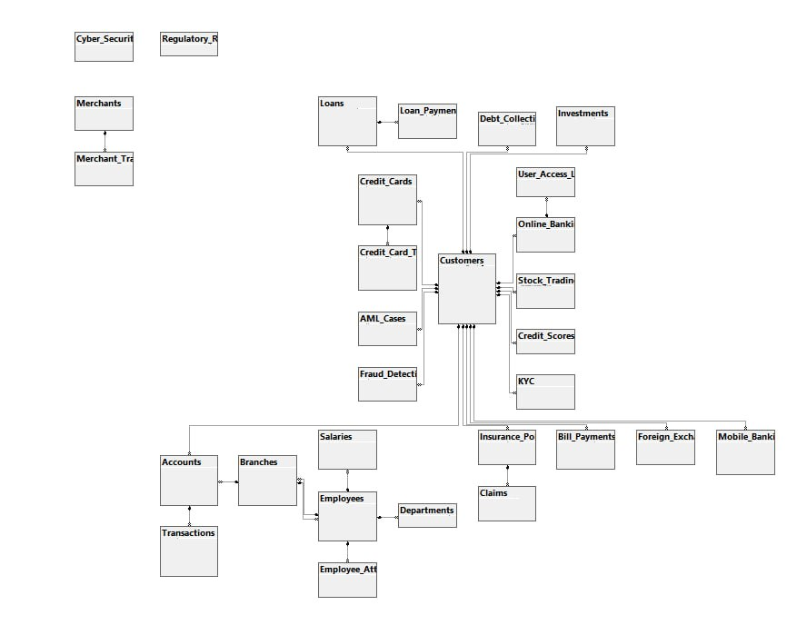

# Bank Data Analytics (SQL)

## Overview
This project performs SQL-based analytics on banking data to generate KPIs and detect potential fraud patterns.

## Data Structure
The image below shows how the banking data is structured across tables.

## Key KPIs and Analytics

This project analyzes banking data using SQL to generate important business insights and detect potential fraud. The key performance indicators (KPIs) include:

### Core Banking KPIs
- **Top Customers by Total Balance**  
  Identifies the highest-value customers based on total account balances across all accounts.

- **Customers with Multiple Active Loans**  
  Highlights customers with more than one active loan, indicating higher credit exposure.

- **Fraudulent Transactions**  
  Tracks transactions flagged as fraudulent by the system.

- **Total Loan Amount per Branch**  
  Measures lending volume and branch performance.

- **Large Transactions in Short Time Periods**  
  Detects customers making multiple large transactions (e.g., above $10,000) within a short time frame.

- **Cross-Country Transaction Fraud Detection**  
  Flags customers who conduct transactions from different countries within a short time window, a common red flag for fraud.

### Advanced Risk & Fraud KPIs
- **Rapid Balance Drain Detection**  
  Identifies accounts that lose a large percentage of their balance within a short time window (e.g., 24 hours), indicating possible account takeover or fraud.

- **Dormant Account Reactivation Risk**  
  Flags accounts that were inactive for an extended period and suddenly show high transaction activity.

- **Transaction Velocity Spike**  
  Detects abnormal increases in transaction frequency compared to a customer’s historical behavior.

- **Structuring (Smurfing) Detection**  
  Identifies multiple transactions just below regulatory reporting thresholds within a short period.

- **Cross-Border Transaction Concentration**  
  Flags customers who transact across multiple countries within a short time window.

- **High-Risk Loan Concentration per Branch**  
  Measures the percentage of high-risk loans issued by each branch to identify operational risk hotspots.

- **Loan-to-Income Stress Indicator**  
  Identifies customers whose total loan exposure significantly exceeds their declared income.

- **Unusual Transaction Amount Pattern**  
  Detects repeated transactions with identical or near-identical amounts, often linked to automated fraud.

- **New Payee Rapid Transaction Pattern**  
  Flags large or multiple transactions made shortly after adding a new beneficiary or payee.

- **Round-Amount Transaction Frequency**  
  Identifies frequent round-amount transactions, which may indicate money laundering behavior.

## Files
- `bank_analysis.sql` → SQL queries for KPIs and fraud analysis

## Author
Samandar 
